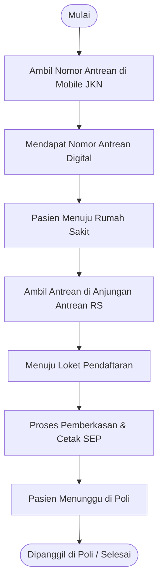

# Sistem Antrian Digital — RSU Handayani Kotabumi

> **Pengembang:** Chandra Irawan, M.T.I  
> **Traktir Kopi:** https://saweria.co/KumbangKobum  
> **Stack:** PHP 8 · MariaDB 10.4 · JavaScript (Vanilla)  
> **Database:** `antrian_db` (utama) · `sik` / SIMRS Khanza (hanya baca, untuk MJKN)

---

## Daftar Isi

1. [Gambaran Sistem](#1-gambaran-sistem)
2. [Alur Pasien MJKN](#2-alur-pasien-mjkn)
3. [Struktur Direktori](#3-struktur-direktori)
4. [Instalasi](#4-instalasi)
5. [Konfigurasi](#5-konfigurasi)
6. [Database](#6-database)
7. [Cara Penggunaan](#7-cara-penggunaan)
8. [API Internal](#8-api-internal)
9. [Catatan Teknis](#9-catatan-teknis)

---

## 1. Gambaran Sistem

Sistem antrian digital untuk RSU Handayani Kotabumi yang mendukung tiga jalur:

| Jalur | Kode Tiket | Loket | Keterangan |
|---|---|---|---|
| Pendaftaran Walk-in | `P0001` – `P9999` | 1 – 5 | Pasien datang langsung tanpa daftar online |
| Fisioterapi Walk-in | `F0001` – `F9999` | 6 – 8 | Pasien fisioterapi datang langsung |
| MJKN (Mobile JKN) | `M0001` – `M9999` | 1 – 5 | Pasien yang sudah daftar via aplikasi BPJS Mobile JKN |

Pasien MJKN mendapat **dua nomor** pada tiket cetaknya:
- **No. Urutan Panggil Loket** — kode antrian sistem misal `M0015`, untuk dipantau di layar display
- **No. Antrian MJKN** — format `KODEPOLI-NOURUT` misal `ANA-3`, sebagai referensi dari aplikasi Mobile JKN

---

## 2. Alur Pasien MJKN



---

## 3. Struktur Direktori

```
antrian/
├── index.php                    # Portal / menu utama
├── config/
│   ├── database.php             # Koneksi antrian_db dan sik (lazy)
│   ├── admin_auth.php           # IP whitelist untuk halaman admin
│   ├── .env.php                 # Kredensial (TIDAK masuk git)
│   └── .env.example.php         # Template kredensial
├── ambil/
│   ├── index.php                # Pilih jenis antrian
│   ├── simpan.php               # Buat antrian walk-in (P/F), auto-redirect cetak
│   ├── cetak.php                # Cetak tiket walk-in
│   ├── mjkn.php                 # Form input + lookup MJKN ke SIK
│   └── cetak_mjkn.php           # Cetak tiket MJKN
├── panggil/
│   ├── index.php                # Layar display gabungan (P + F) untuk TV
│   ├── pendaftaran.php          # Layar display antrian pendaftaran (P + M)
│   ├── fisioterapi.php          # Layar display antrian fisioterapi (F)
│   ├── admin.php                # Panel panggil gabungan (admin)
│   ├── admin_pendaftaran.php    # Panel panggil khusus pendaftaran
│   └── admin_fisioterapi.php    # Panel panggil khusus fisioterapi
├── api/
│   ├── call.php                 # Panggil nomor antrian → update status + last_called
│   ├── finish.php               # Tandai antrian selesai
│   ├── list_queue.php           # Daftar antrian aktif (menunggu/dipanggil)
│   ├── get_display.php          # Data lengkap untuk layar display (polling)
│   └── stats.php                # Statistik harian
├── assets/
│   ├── css/global.css           # Style global
│   ├── css/print.css            # Style cetak tiket (75mm)
│   ├── js/tts.js                # Text-to-Speech pemanggilan
│   └── video/edukasi.mp4        # Video edukatif di layar display
└── sql/
    ├── init.sql                 # Skema lengkap untuk instalasi baru
    └── mjkn_migration.sql       # Migrasi untuk instalasi yang sudah berjalan
```

---

## 4. Instalasi

### Prasyarat

- PHP 8.0 atau lebih baru (ekstensi `mysqli` aktif)
- MariaDB 10.4 / MySQL 8 atau lebih baru
- Web server Apache/Nginx
- Akses baca ke database `sik` (SIMRS Khanza)

### A. Instalasi Baru

**1. Buat database**
```sql
CREATE DATABASE antrian_db CHARACTER SET utf8mb4 COLLATE utf8mb4_unicode_ci;
```

**2. Import skema**
```bash
mysql -u root -p antrian_db < sql/init.sql
```

**3. Salin file ke web server**
```bash
cp -r antrian/ /var/www/html/antrian
```

**4. Buat file kredensial**
```bash
cp config/.env.example.php config/.env.php
# Edit config/.env.php sesuai lingkungan Anda
```

**5. Sesuaikan konfigurasi** — lihat [Bagian 5](#5-konfigurasi)

---

### B. Upgrade dari Versi Sebelumnya

Jika `antrian_db` sudah ada namun belum memiliki kolom MJKN, jalankan migrasi satu kali:

```bash
mysql -u root -p antrian_db < sql/mjkn_migration.sql
```

Atau via phpMyAdmin → tab SQL:
```sql
ALTER TABLE antrian
  ADD COLUMN no_reg_mjkn VARCHAR(20) NULL DEFAULT NULL AFTER jenis;

ALTER TABLE antrian
  ADD UNIQUE KEY uq_mjkn_per_hari (tgl, no_reg_mjkn);

ALTER TABLE antrian
  MODIFY COLUMN jenis ENUM('P','F','M') NOT NULL;

ALTER TABLE last_called
  MODIFY COLUMN jenis ENUM('P','F','M') NOT NULL;

INSERT IGNORE INTO last_called (jenis, kode, loket) VALUES ('M', '-', NULL);
```

---

### C. Verifikasi Instalasi

Buka browser dan akses:
```
http://localhost/antrian/
```

Uji tiap jalur:
- **Pendaftaran walk-in** → Ambil Antrian → Pendaftaran → tiket `P____` tercetak ✓
- **Fisioterapi walk-in** → Ambil Antrian → Fisioterapi → tiket `F____` tercetak ✓
- **MJKN** → Ambil Antrian → MJKN → input kode + nomor → tiket `M____` tercetak ✓
- **Display TV** → `panggil/pendaftaran.php` → layar tampil, suara TTS berfungsi ✓
- **Panel admin** → `panggil/admin_pendaftaran.php` → tombol Panggil berjalan ✓

---

## 5. Konfigurasi

### File Kredensial

Salin template dan isi nilainya:
```bash
cp config/.env.example.php config/.env.php
```

```php
// config/.env.php  — TIDAK boleh masuk git
return [
  // Database antrian (wajib)
  'DB_HOST' => 'localhost',
  'DB_USER' => 'root',
  'DB_PASS' => 'password_anda',
  'DB_NAME' => 'antrian_db',

  // Database SIK — hanya SELECT, untuk fitur MJKN
  'SIK_HOST' => '192.168.x.x',
  'SIK_USER' => 'antrian_ro',
  'SIK_PASS' => 'password_sik',
  'SIK_NAME' => 'sik',

  // IP komputer yang boleh akses halaman admin
  // Kosongkan array [] untuk nonaktifkan pembatasan (dev only)
  'ADMIN_IPS' => [
    '192.168.4.10',   // komputer loket 1
    '192.168.4.11',   // komputer loket 2
  ],
];
```

> `config/.env.php` sudah terdaftar di `.gitignore` — tidak akan ikut ter-commit.

### Koneksi SIK

Koneksi ke database `sik` bersifat **lazy** (hanya dibuat saat halaman MJKN dipanggil) dengan timeout **3 detik**. Jika server SIK tidak tersedia, halaman lain tetap berjalan normal — hanya form MJKN yang menampilkan pesan error.

### Pembatasan Akses Admin

File `config/admin_auth.php` membatasi akses ke halaman admin berdasarkan IP. Daftarkan IP komputer petugas loket di `ADMIN_IPS`. Jika array dikosongkan, semua IP bisa akses (hanya untuk development).

---

## 6. Database

### Database: `antrian_db`

#### Tabel `antrian`

| Kolom | Tipe | Keterangan |
|---|---|---|
| `id` | int PK AUTO_INCREMENT | |
| `tgl` | date | Tanggal antrian |
| `jenis` | enum('P','F','M') | P = Pendaftaran walk-in, F = Fisioterapi, M = MJKN |
| `no_reg_mjkn` | varchar(20) NULL | `null` jika walk-in. Format `KD_BPJS-NOURUT` misal `ANA-3` jika MJKN |
| `nomor` | int | Nomor urut per jenis per hari |
| `status` | enum('menunggu','dipanggil','selesai') | Default: `menunggu` |
| `loket` | tinyint NULL | Loket yang memanggil |
| `created_at` | timestamp | Waktu ambil antrian |
| `called_at` | datetime NULL | Waktu pertama dipanggil |
| `finished_at` | datetime NULL | Waktu selesai dilayani |

Index:
- `PRIMARY KEY (id)`
- `KEY idx_tgl_jenis_status (tgl, jenis, status)` — query antrian aktif hari ini
- `UNIQUE KEY uq_mjkn_per_hari (tgl, no_reg_mjkn)` — cegah pasien MJKN dapat 2 nomor

#### Tabel `last_called`

| Kolom | Tipe | Keterangan |
|---|---|---|
| `jenis` | enum('P','F','M') PK | |
| `kode` | varchar(10) | Kode terakhir dipanggil, misal `M0015` |
| `loket` | tinyint NULL | Loket yang memanggil |
| `updated_at` | timestamp ON UPDATE | Layar display memantau kolom ini untuk deteksi panggilan baru |

---

### Akses ke Database `sik`

Buat user MySQL khusus read-only — **jangan gunakan `root`** di production:

```sql
-- Jalankan di server SIK sebagai admin MySQL
CREATE USER 'antrian_ro'@'IP_SERVER_ANTRIAN' IDENTIFIED BY 'password_aman';

GRANT SELECT ON sik.reg_periksa              TO 'antrian_ro'@'IP_SERVER_ANTRIAN';
GRANT SELECT ON sik.pasien                   TO 'antrian_ro'@'IP_SERVER_ANTRIAN';
GRANT SELECT ON sik.poliklinik               TO 'antrian_ro'@'IP_SERVER_ANTRIAN';
GRANT SELECT ON sik.dokter                   TO 'antrian_ro'@'IP_SERVER_ANTRIAN';
GRANT SELECT ON sik.maping_poli_bpjs         TO 'antrian_ro'@'IP_SERVER_ANTRIAN';
GRANT SELECT ON sik.referensi_mobilejkn_bpjs TO 'antrian_ro'@'IP_SERVER_ANTRIAN';

FLUSH PRIVILEGES;
```

Ganti `IP_SERVER_ANTRIAN` dengan IP server tempat sistem antrian berjalan. Jika satu server, gunakan `'localhost'`.

### Database: `sik` — Tabel yang Dibaca

| Tabel | Kolom yang dipakai |
|---|---|
| `reg_periksa` | `no_reg`, `no_rawat`, `tgl_registrasi`, `jam_reg`, `kd_dokter`, `no_rkm_medis`, `kd_poli` |
| `pasien` | `no_rkm_medis`, `nm_pasien` |
| `poliklinik` | `kd_poli`, `nm_poli` |
| `dokter` | `kd_dokter`, `nm_dokter` |
| `maping_poli_bpjs` | `kd_poli_rs`, `kd_poli_bpjs`, `nm_poli_bpjs` |
| `referensi_mobilejkn_bpjs` | `no_rawat`, `nobooking` |

---

## 7. Cara Penggunaan

### 7.1 Pasien — Antrian Walk-in

1. Buka kiosk → pilih **Pendaftaran Pasien** (Loket 1–5) atau **Fisioterapi** (Loket 6–8)
2. Tiket cetak otomatis tampil dengan kode antrian dan jam
3. Tunggu panggilan di layar display

### 7.2 Pasien — Antrian MJKN

1. Buka aplikasi **Mobile JKN** (BPJS Kesehatan) di ponsel — catat **kode poli** dan **nomor urut** jadwal kunjungan hari ini _(misal: Poli Anak → kode `ANA`, nomor urut `3`)_
2. Di kiosk, klik **Ambil Antrian MJKN**
3. Isi dua kolom menggunakan keyboard virtual:
   - **Kode Poli:** `ANA` _(huruf kapital, sesuai aplikasi)_
   - **No. Urut:** `3`
4. Klik **Ambil Nomor Antrian**
5. Tiket cetak tampil, berisi:
   - **No. Urutan Panggil Loket** misal `M0015` — pantau di layar display
   - **No. Antrian MJKN** misal `ANA-3` — referensi dari aplikasi
   - Nama pasien dan nama poliklinik
6. Jika kode dan nomor yang sama dimasukkan lagi, sistem mengembalikan nomor yang **sudah ada** — tidak dobel

### 7.3 Petugas Loket — Memanggil Antrian

1. Buka panel admin sesuai jalur:
   - `panggil/admin_pendaftaran.php` — antrian Pendaftaran (P) + MJKN (M), Loket 1–5
   - `panggil/admin_fisioterapi.php` — antrian Fisioterapi (F), Loket 6–8
   - `panggil/admin.php` — panel gabungan semua jenis
2. Pilih nomor **Loket** di dropdown
3. Klik **Panggil** pada baris pasien yang ingin dipanggil
4. Layar display dan suara TTS otomatis memperbarui
5. Setelah pasien selesai dilayani, klik **Selesai**

> Halaman admin hanya bisa diakses dari IP yang terdaftar di `ADMIN_IPS` pada `config/.env.php`.

### 7.4 Admin — Layar Display TV

| URL | Tampilan |
|---|---|
| `panggil/pendaftaran.php` | Display antrian Pendaftaran (P) + MJKN (M), sidebar dua kartu |
| `panggil/fisioterapi.php` | Display antrian Fisioterapi (F) |
| `panggil/index.php` | Display gabungan: video edukatif + sidebar P dan F |

Buka di browser layar TV dalam mode fullscreen (F11). Klik tombol **Aktifkan Suara** satu kali setelah halaman terbuka agar TTS berfungsi. Data diperbarui otomatis setiap **2 detik**.

---

## 8. API Internal

Semua endpoint di direktori `api/`, bertipe JSON.

| Endpoint | Method | Parameter | Respons |
|---|---|---|---|
| `call.php` | POST | `{id, loket}` | `{ok, kode, loket}` |
| `finish.php` | POST | `{id}` | `{ok}` |
| `list_queue.php` | GET | `?jenis=P` atau `?jenis=F` | `{data: [{id, kode, no_reg_mjkn, status, created_at}]}` |
| `get_display.php` | GET | — | `{last: {P,M,F}, waiting: {P,M,F}, time}` |
| `stats.php` | GET | — | Statistik jumlah per status per jenis |

`list_queue.php?jenis=P` mengembalikan antrian jenis `P` **dan** `M` (keduanya dilayani di loket 1–5).

---

## 9. Catatan Teknis

- **Kredensial:** Disimpan di `config/.env.php` yang terdaftar di `.gitignore`. Jangan pernah commit file ini. Gunakan `config/.env.example.php` sebagai template.
- **Akses admin:** Dibatasi via IP whitelist di `config/admin_auth.php`. Daftarkan IP komputer petugas di `ADMIN_IPS`.
- **Race condition MJKN:** Penomoran MJKN menggunakan transaksi MySQL dengan `SELECT ... FOR UPDATE` sehingga dua pasien yang submit bersamaan tidak mendapat nomor yang sama.
- **Koneksi SIK:** Lazy-loaded dengan timeout 3 detik. Jika SIK down, hanya halaman MJKN yang error — antrian walk-in tetap berjalan.
- **TTS (Text-to-Speech):** Menggunakan Web Speech API. Wajib ada interaksi pengguna (klik "Aktifkan Suara") sebelum TTS berjalan — ini kebijakan keamanan browser modern, bukan bug.
- **Polling display:** Interval 2 detik. Perubahan terdeteksi dari `updated_at` pada `last_called`, bukan query ulang seluruh antrian — ringan di database.
- **Duplikat MJKN:** Jika pasien input kode yang sama dua kali, `UNIQUE KEY (tgl, no_reg_mjkn)` mendeteksinya dan mengembalikan nomor yang sudah ada.
- **Keunikan nomor MJKN:** Format `KD_BPJS-NOURUT` unik per poli per hari. Dua poli berbeda memiliki kode BPJS berbeda sehingga nomor urut yang sama di dua poli tidak bertabrakan (misal `ANA-3` ≠ `INT-3`).
- **SQL Injection:** Semua query menggunakan `prepared statement`.
- **XSS:** Semua data dari API di-escape via fungsi `esc()` sebelum dimasukkan ke `innerHTML`.
- **Auto-cleanup:** Data antrian lebih dari 30 hari dihapus otomatis saat ada pasien walk-in ambil nomor (`simpan.php`). Tidak perlu cron job.
- **Timezone:** Semua waktu WIB (`Asia/Jakarta` / `+07:00`), diset di `config/database.php`.
- **Database SIK hanya dibaca:** Sistem ini tidak pernah menulis ke database `sik`. Seluruh data antrian disimpan di `antrian_db`.
